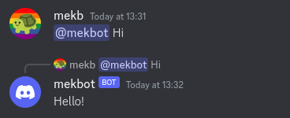

    <h1><a href="#">AI Discord Bot</a></h1>
    <h3 align="center">A Discord bot to interact with <a href="https://github.com/jmorganca/ollama">Ollama</a> and <a href="https://github.com/AUTOMATIC1111/stable-diffusion-webui">Stable Diffusion</a> for chatbot features</h3>
    <h3></h3>
    <h3></h3>

## New Maintainer
This repository is no longer maintained by the original developer, [mekb-turtle](https://github.com/mekb-turtle), but has been forked to continue support.

## Setup Instructions

### Prerequisites
- **Node.js** (recommended v14+)
- **Ollama**: for AI model support
- **Discord Developer Account**: to create and configure a bot
- **Stable Diffusion WebUI** (optional, for image generation)

### Steps
1. **Install Node.js**
   - [Download and install Node.js](https://nodejs.org) if not already installed (preferably via a package manager).

2. **Install Ollama**
   - Follow installation steps in the [Ollama GitHub repo](https://github.com/jmorganca/ollama).
   - Pull a model, e.g., `ollama pull orca` or `ollama pull llama2`.

3. **Start Ollama Service**
   - Run `ollama serve` to start the Ollama server.

4. **Create and Configure Discord Bot**
   - Create a bot on the [Discord Developer Portal](https://discord.com/developers/applications).
   - Under **Application > Bot**:
     - Enable **Message Content Intent**.
     - Enable **Server Members Intent** (for user mention handling).

5. **Invite the Bot to Your Server**
   - Go to **OAuth2 > URL Generator**:
     - Select `bot` under scopes.
     - Enable permissions for **Send Messages**, **Read Messages/View Channels**, and **Read Message History**.
     - Copy the generated URL and open it to invite the bot to your server.

6. **Configure Environment Variables**
   - Rename `.env.example` to `.env` and edit it with the necessary configuration:
     - Add the **Discord token** (from **Application > Bot > Token**).
     - Update the **model** name if you’re not using `orca`.
     - Set the **Ollama server URL** (default is fine unless customized).
     - Specify **channel IDs** where the bot will operate, separated by commas.
       - Enable **Developer Mode** in Discord under **User Settings > Advanced** to copy Channel IDs.
     - Optionally, modify or disable the bot’s system message.

7. **Install Dependencies**
   - Run `npm install` to install the required Node.js dependencies.

8. **Run the Bot**
   - Start the bot using `npm start`.
   - Interact with the bot by @mentioning it in the specified Discord channels.

9. **Set Up Stable Diffusion (Optional)**
   - [Install Stable Diffusion](https://github.com/AUTOMATIC1111/stable-diffusion-webui).
   - Run `./webui.sh --api --listen` to start the Stable Diffusion server.

### Docker Setup Instructions
To run the bot with Docker:

1. **Install Docker**
   - Ensure compatibility with Docker Compose v3 (Docker Engine 1.13.0+).

2. **Complete Steps 2–7 from Above**

3. **Start the Bot with Docker Compose**
   - Use `make compose-up` if you have Make installed.
   - Alternatively, run `docker compose -p ai-discord-bot up`.

4. **Interact with the Bot**
   - Mention the bot in any allowed channel to initiate interactions.

---

